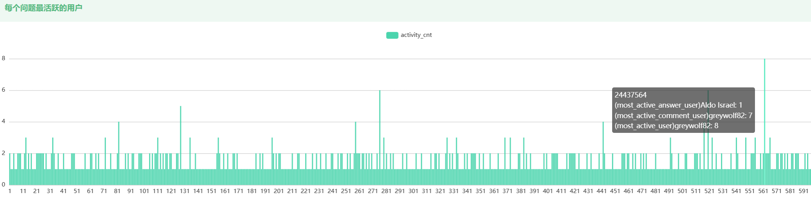
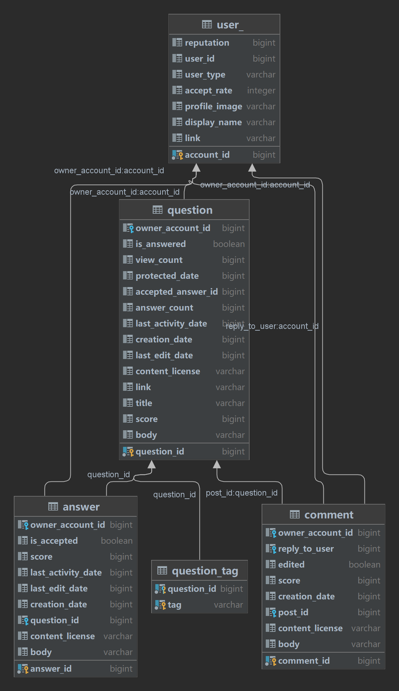

# CS209A 期末项目报告

2023春季学期   
指导老师：陶伊达   
项目组：唐培致、汪清扬

## 前端部分

本次项目的前端部分基于开源项目开发，采用了vue2技术框架，并且实现了前后端分离开发，提升了开发效率。   
github 仓库地址：https://github.com/TANGHULU6/Frontend_javaII

### 技术栈

前端部分使用了以下技术和框架：

- Element-ui：用于构建用户界面。
- v-chart：用于可视化图表的绘制。
- vue2：用于处理用户交互和页面操作。
- 技术栈基于 [ES2015+](http://es6.ruanyifeng.com/)、[vue](https://cn.vuejs.org/index.html)、[vuex](https://vuex.vuejs.org/zh-cn/)、[vue-router](https://router.vuejs.org/zh-cn/) 、[axios](https://github.com/axios/axios) 和 [element-ui](https://github.com/ElemeFE/element)

### 页面布局与可视化

前端页面呈现了直观的可视化图形，并具备一定的美观度。图表和数据展示采用了交互式和响应式设计，使用户能够轻松地浏览和操作数据。

### 数据分析与可视化

### Answers

#### 问题 1: 没有答案的问题的百分比

我们展示了没有答案的问题的百分比。这有助于了解问题的回答情况和潜在的需求缺口。

#### 问题 2: Answer 数量的平均值和最大值

我们展示了 Answer 数量的平均值和最大值。这有助于了解问题的回答活跃程度和热门问题的答案数量。

#### 问题 3: Answer 数的分布

我们展示了 Answer 数的分布情况，并使用直方图进行可视化。这有助于了解不同问题的回答数量范围和分布情况。

#### 问题 4: 有 Accepted Answer 的问题的百分比

我们展示了有 Accepted Answer 的问题的百分比，并使用饼图进行可视化。这有助于了解问题的解决程度和回答质量。

#### 问题 5: 问题的解决时间间隔分布

我们展示了问题从提出到解决的时间间隔分布，并使用区间图进行可视化。这有助于了解问题的解决效率和解决时间的分布情况。

#### 问题 6: 含有非 Accepted Answer 的 Upvote 数高于 Accepted Answer 的问题的百分比

我们展示了含有非 Accepted Answer 的 Upvote 数高于 Accepted Answer 的问题的百分比，并使用饼图进行可视化。这有助于了解回答质量和社区对于不同答案的评价。

### Tags

#### 问题7: 经常和 Java tag 一起出现的 tags

我们展示了经常和 Java tag 一起出现的 tags，并使用柱状图进行可视化。这有助于了解 Java 相关问题的关联标签，以及在 Java 社区中讨论的其他相关技术和主题。

#### 问题8: 得到最多 upvotes 的 tags 或 tag 组合

我们展示了得到最多 upvotes 的 tags 或 tag 组合，并使用柱状图进行可视化。这有助于了解在 Stack Overflow 上受欢迎的标签和话题，以及用户对这些问题的兴趣和评价。

#### 问题9: 得到最多 views 的 tags 或 tag 组合

我们展示了得到最多 views 的 tags 或 tag 组合，并使用柱状图进行可视化。这有助于了解在 Stack Overflow 上最受关注和浏览的标签和话题，以及用户对这些问题的关注度。

### Users

#### 问题10: 参与 Thread 讨论的用户数量的分布

我们展示了参与 Thread 讨论的用户数量的分布，并使用直方图进行可视化。这有助于了解不同 Thread 讨论的参与度和活跃程度，以及社区中用户的贡献程度。并且从问题回答者和评论者两个角度进行统计，展示了参与 Thread 讨论的用户数量和分布情况。这有助于了解回答问题和发表评论的用户群体，以及他们在社区中的活跃程度。

#### 问题11: 参与 Java Thread 讨论最活跃的用户

我们展示了参与 Java Thread 讨论最活跃的用户，并使用柱状图进行可视化。这有助于了解在 Java Thread 相关问题上最积极参与讨论的用户，以及他们在社区中的贡献和影响力。

通过对这些问题的数据分析和可视化，我们可以获得关于标签关联性、热门标签、用户参与度和活跃用户等方面的洞察。这些洞察有助于了解社区的兴趣和话题，评估用户的参与度，并为用户提供更有针对性的内容和互动。

总的来说，前后端分离可以提供更好的灵活性、可扩展性、并行开发、技术栈多样性、可重用性和维护性，以及更好的团队协作。这大大提升了我们团队的合作效率。

参考开源项目：

[mgbq/nx-admin: 👍 A magical 🐮 ⚔ vue admin，记得star (github.com)](https://github.com/mgbq/nx-admin)

## 后端部分
本项目的后端部分包括对 StackOverflow 网站数据的爬取、存储，和对数据库数据进行的查询处理。项目后端采用 SpringBoot 框架，以实现快速开发。   
github 仓库地址：https://github.com/qwq-y/StackOverflow_Statistics

### 技术栈
- SpringBoot：用于快速搭建应用程序的基础框架和配置。
- PostgreSQL：作为数据库提供可靠的数据存储。
- Hibernate：作为ORM框架简化数据库操作。
- JUnit：作为单元测试框架可以确保代码的正确性和质量。

### 数据爬取
我们使用 Java 爬取数据，把数据存储在数据库，以便后续进行查询。数据存储的结构如下图所示，共包含 5 张表格（question, comment, answer, user_, question_tag），分别存储问题、评论、回答、用户、标签，表间通过外键相连。

在爬取数据时，后端首先生成 url，然后发送请求，通过输入流读取返回内容。我们首先得到了 600 条 question 的数据储存在表中，紧接着根据 question 的 id 获取每个问题下的回答和评论，存在相应的表中；在这个过程中，我们对于每个问题、回答和评论，都获取了其作者的用户信息，去重后存储在数据库中。此外，在存储 question 时，我们把 tag 和 question 的对应信息单独存储在了 question_tag 表中。

### 数据处理

使用 Java Persistence API (JPA) 规范来简化Java应用程序与数据库之间的数据持久化操作。对于每个数据处理需求，后端的查询方法如下：

#### Answers

##### 问题 1: 没有答案的问题的百分比
使用 JPA 提供的映射方法，返回 countByAnswerCountEquals(0) 的值即为没有回答的问题的个数。

##### 问题 2: Answer 数量的平均值和最大值
数据库查询语句分别为：

    SELECT MAX/AVG(answer_count) 
    FROM question

##### 问题 3: Answer 数的分布
这个接口返回一个 List<Object[]>，其中 Object[] 包含两列数据：回答的个数，和回答个数为该值的问题数。数据库查询语句如下：

    SELECT q.answer_count, COUNT(*) AS count
    FROM question q
    GROUP BY q.answer_count
    ORDER BY q.answer_count

##### 问题 4: 有 Accepted Answer 的问题的百分比
使用 JPA 提供的映射方法，返回 countByAcceptedAnswerIdIsNotNull 的值即为有 Accepted Answer 的问题的个数。

##### 问题 5: 问题的解决时间间隔分布
这个接口返回一个 List<Object[]>，其中 Object[] 包含两列数据：问题的解决时间（根据问题发布时间和被采纳的回答的发布时间的差值计算），和问题解决时间为该值的问题数。数据库查询语句如下：

    SELECT a.creation_date - q.creation_date AS duration, COUNT(*) AS count
    FROM question q
            JOIN answer a ON q.accepted_answer_id = a.answer_id
    GROUP BY duration
    ORDER BY duration

##### 问题 6: 含有非 Accepted Answer 的 Upvote 数高于 Accepted Answer 的问题的百分比
返回含有非 Accepted Answer 的 Upvote 数高于 Accepted Answer 的问题的个数，数据库查询语句为：

    SELECT COUNT(DISTINCT q.question_id)
    FROM question q
            JOIN answer a ON q.accepted_answer_id = a.answer_id
    WHERE a.score < (SELECT MAX(a2.score) FROM answer a2 WHERE a2.question_id = q.question_id)

#### Tags

##### 问题7: 经常和 Java tag 一起出现的 tags
这个接口返回一个 List<Object[]>，其中 Object[] 包含两列数据：tag（除了'java'之外），和该 tag 和 'java' tag 一起出现的次数。列表按照频率的降序排列。数据库查询语句如下：

    SELECT qt.tag, COUNT(*) AS count
    FROM question_tag qt
    WHERE qt.question_id IN (SELECT q.question_id
                            FROM question q,
                                question_tag qt2
                            WHERE q.question_id = qt2.question_id
                            AND qt2.tag = 'java')
    AND qt.tag != 'java'
    GROUP BY qt.tag
    ORDER BY count DESC

##### 问题8: 得到最多 upvotes 的 tags 或 tag 组合
这个接口返回一个 List<Object[]>，其中 Object[] 包含两列数据：tag 的两两组合，和该组合收获的分数。列表按照分数的降序排列。数据库查询语句如下：

    SELECT CONCAT(qt1.tag, ',', qt2.tag) AS tag_combination, SUM(q.score) AS total_score
    FROM question_tag qt1
            JOIN question_tag qt2 ON qt1.question_id = qt2.question_id
            JOIN question q ON qt1.question_id = q.question_id
    WHERE qt1.tag < qt2.tag
    GROUP BY tag_combination
    ORDER BY total_score DESC

##### 问题9: 得到最多 views 的 tags 或 tag 组合
这个接口返回一个 List<Object[]>，其中 Object[] 包含两列数据：tag 的两两组合，和该组合收获的浏览量。列表按照浏览量的降序排列。数据库查询语句如下：

    SELECT CONCAT(qt1.tag, ',', qt2.tag) AS tag_combination, SUM(q.view_count) AS total_view
    FROM question_tag qt1
            JOIN question_tag qt2 ON qt1.question_id = qt2.question_id
            JOIN question q ON qt1.question_id = q.question_id
    WHERE qt1.tag < qt2.tag
    GROUP BY tag_combination
    ORDER BY total_view DESC

#### Users

##### 问题10: 参与 Thread 讨论的用户数量的分布
这个接口返回每个问题下，参与回答和评论分别的不重复的用户数量。数据库查询语句如下：

    SELECT q.question_id,
       COUNT(DISTINCT q.owner_account_id),
       COUNT(DISTINCT a.owner_account_id) AS answer_user_count,
       COUNT(DISTINCT c.owner_account_id) AS comment_user_count
    FROM question q
            LEFT JOIN answer a ON q.question_id = a.question_id
            LEFT JOIN comment c ON q.question_id = c.post_id
    GROUP BY q.question_id

##### 问题11: 参与 Java Thread 讨论最活跃的用户
这个接口返回一个 List<Object[]>，其中 Object[] 包含七列数据：question 的 id， 回答最活跃的用户和该用户的回答数，评论最活跃的用户和该用户的评论数，总体最活跃的用户和该用户的回答、评论总数。数据库查询语句如下：

    SELECT q.question_id,\n"
        a.display_name AS most_active_answer_user,\n"
        a.cnt AS user_answer_cnt,\n"
        c.display_name AS most_active_comment_user,\n"
        c.cnt AS user_comment_cnt,\n"
        u.display_name AS most_active_user,\n"
        COALESCE(a.cnt, 0) + COALESCE(c.cnt, 0) AS total_activity_cnt\n"
    FROM question q\n"
    LEFT JOIN (\n"
        SELECT a.question_id, u.display_name, COUNT(DISTINCT a.answer_id) AS cnt,\n"
            ROW_NUMBER() OVER (PARTITION BY a.question_id ORDER BY COUNT(DISTINCT a.answer_id) DESC) AS rn\n"
        FROM answer a\n"
        JOIN user_ u ON u.account_id = a.owner_account_id\n"
        GROUP BY a.question_id, u.display_name\n"
    ) a ON a.question_id = q.question_id AND a.rn = 1\n"
    LEFT JOIN (\n"
        SELECT c.post_id, u.display_name, COUNT(DISTINCT c.comment_id) AS cnt,\n"
            ROW_NUMBER() OVER (PARTITION BY c.post_id ORDER BY COUNT(DISTINCT c.comment_id) DESC) AS rn\n"
        FROM comment c\n"
        JOIN user_ u ON u.account_id = c.owner_account_id\n"
        GROUP BY c.post_id, u.display_name\n"
    ) c ON c.post_id = q.question_id AND c.rn = 1\n"
    JOIN (\n"
        SELECT u.account_id, u.display_name, COALESCE(SUM(DISTINCT a.answer_id), 0) + COALESCE(SUM(DISTINCT c.comment_id), 0) AS total_cnt,\n"
            ROW_NUMBER() OVER (ORDER BY COALESCE(SUM(DISTINCT a.answer_id), 0) + COALESCE(SUM(DISTINCT c.comment_id), 0) DESC) AS rn\n"
        FROM user_ u\n"
        LEFT JOIN answer a ON u.account_id = a.owner_account_id\n"
        LEFT JOIN comment c ON u.account_id = c.owner_account_id\n"
        GROUP BY u.account_id, u.display_name\n"
    ) u ON u.rn = 1 

#### Advanced

##### 问题12：在 Stack Overflow 上被最频繁讨论的 Java APIs
这个接口返回一个降序排序的列表，包含 Java APIs 和其出现的次数。为了得到该结果，首先获取问题、回答和评论里所有的 body（即内容）部分 html 文件，然后遍历 html 文件中的每个元素，根据元素的标签名为它们加上合适的标记，把数据转换为我们需要的 markdown 格式。接着根据我们的标记设置匹配规则， 使用正则表达式提取 body 里的 Java 代码块，并利用 JavaParser 进行判断。此后，对于 Java 代码块，我们仍然利用 JavaParser，访问并获取代码块中出现的接口。最后，再统计每个不同的 API 出现的次数，把数据转换为包含 Java APIs 和其出现的次数的 List<Object[]> 格式并按照降序排列。

### 前后端交互
后端使用 Representational State Transfer（REST）架构风格设计，前端使用 axios 发送请求和处理响应。在这个过程中，前端调用后端接口，后端进行数据库的查询，然后将处理过后的数据返回给前端，前端根据数据进行直观的可视化展示。

## Insights

### 关于统计结果

1. 在我们统计的 600 条问题数据中，只有 29 条问题含有非 Accepted Answer 的 Upvote 数高于 Accepted Answer 的情况，不到百分之五。这反映出“被采纳”是值得认可的参考依据。
2. 在和 'java' 一起出现的标签中，除了数据类型外，'android', 'spring', 'eclipse', 'mockito', 'maven' 等的出现频率较高，由此对 Java 的常见开发环境及开发工具可见一斑。

### 关于开发模式

前后端分离是一种现代软件开发中常用的软件架构模式，将前端和后端的开发分离，使它们成为独立的系统。前后端分离的几个好处：

1. **灵活性和可扩展性**：前后端分离使前端和后端可以独立进行开发和部署。这样，团队可以根据需求独立扩展和调整前端和后端的功能，而无需影响彼此。

2. **并行开发**：前后端分离允许前端和后端团队并行开发，提高开发效率。前端开发人员可以专注于用户界面和用户体验，而后端开发人员可以专注于业务逻辑和数据处理。这种并行开发减少了项目的交付时间。

3. **技术栈多样性**：前后端分离允许前端和后端使用不同的技术栈和工具。前端可以选择适合他们需求的前端框架和库，后端可以选择适合他们需求的后端语言和框架。这样，团队可以根据自身技术能力和项目需求做出最佳选择。

4. **可重用性和维护性**：前后端分离通过明确定义 API 接口来实现前后端之间的通信。这样，前端和后端可以独立进行开发和维护。同时，API 接口的可重用性也提高了代码的维护性和可测试性。

5. **更好的团队协作**：前后端分离促进了团队之间的协作和沟通。前端和后端团队可以独立合作，减少了彼此之间的依赖。通过明确的接口定义和规范，团队之间的沟通变得更加清晰和高效。

## 分工
唐培致主要负责前端部分，汪清扬主要负责后端部分。
